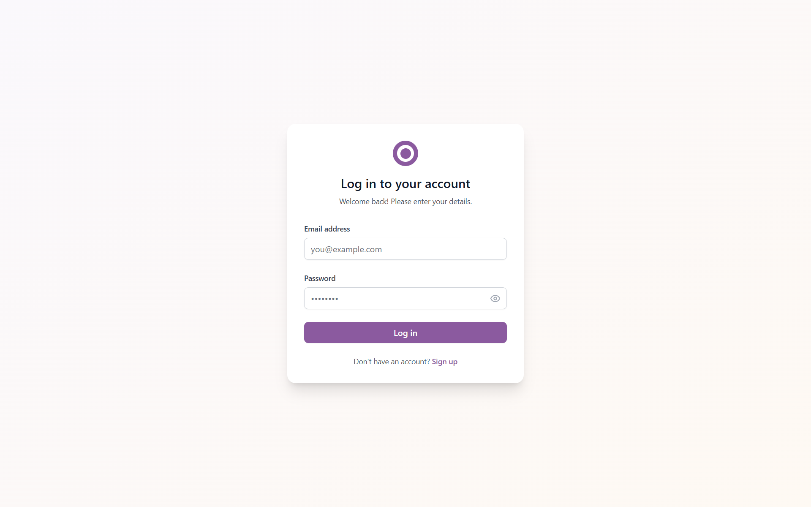
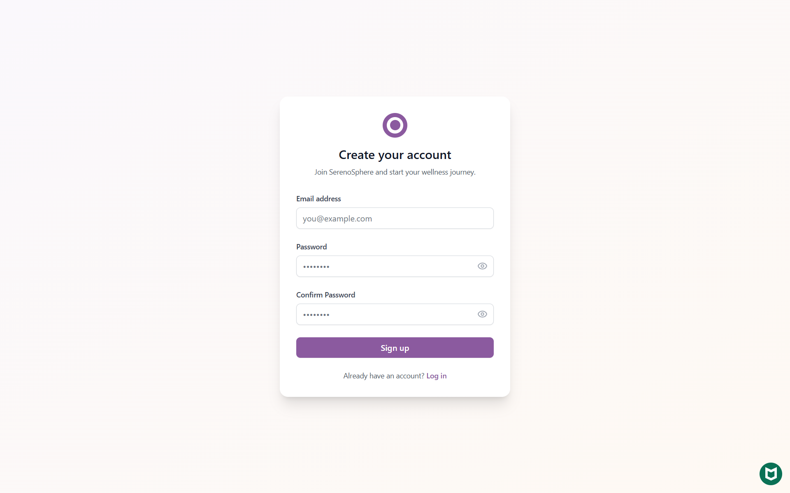
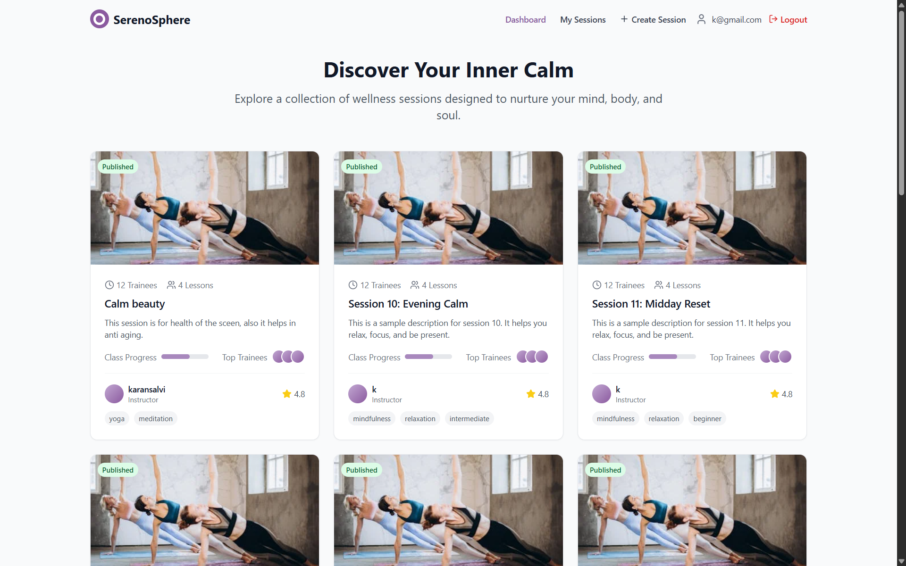
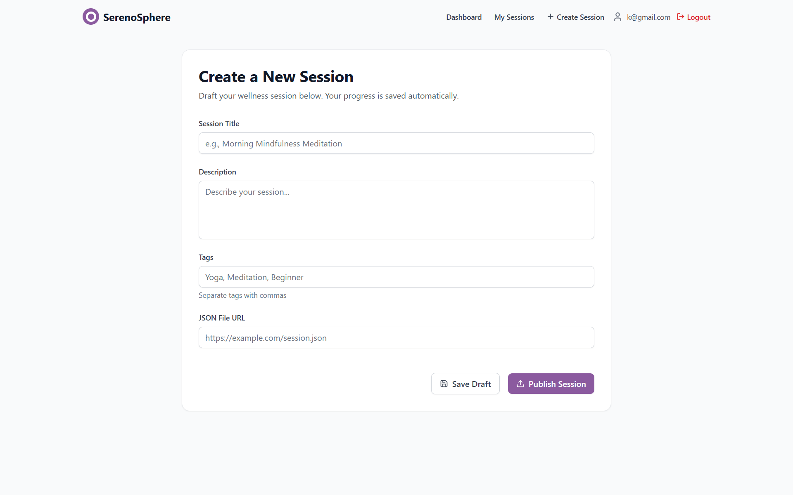
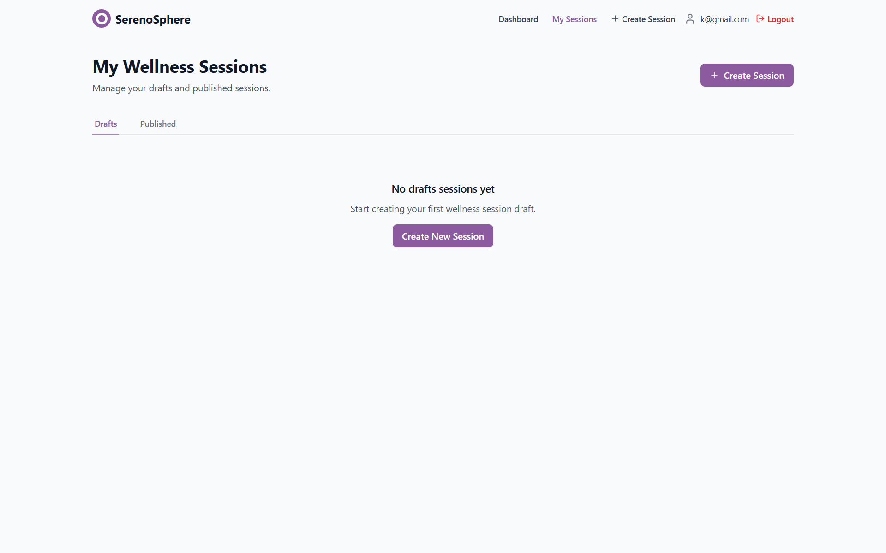
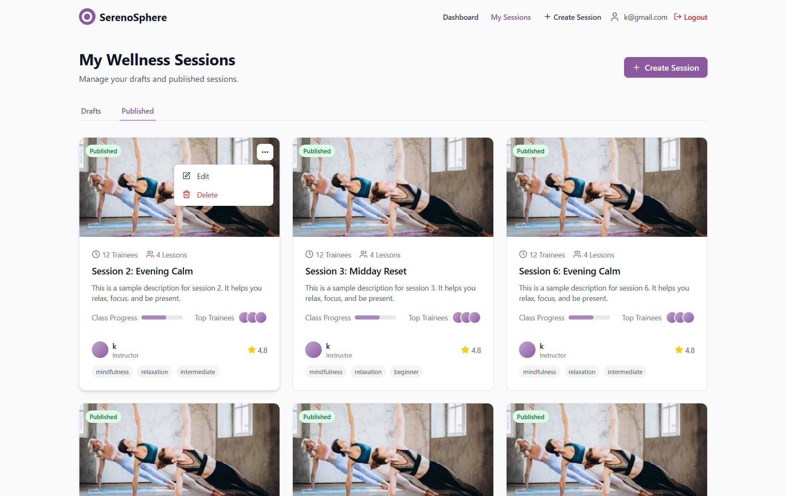

# SerenoSphere - Wellness Session Platform

A full-stack wellness session platform that allows users to discover, create, and manage guided wellness sessions including yoga, meditation, and mindfulness practices.

### Live Link

[Check Live site](https://serenosphere.vercel.app)

### Live demo video

[Check Demo video ](https://drive.google.com/file/d/1ZyfxwM7TOZ3DHMAo4LZPxKi7oCBmIOxQ/view?usp=sharing)

---

### Web Pages









## Features

### 🔐 Authentication

- Secure user registration and login with JWT
- Password hashing with bcrypt
- Protected routes and middleware
- Token-based session management

### ✨ Session Management

- View public wellness sessions
- Create and edit personal sessions
- Draft and publish functionality
- Auto-save drafts after 5 seconds of inactivity
- Tag-based organization
- JSON file URL support for session data

### 🎨 Modern UI/UX

- Responsive design optimized for all devices
- Clean, modern interface with Tailwind CSS
- Smooth animations and micro-interactions
- Professional color scheme and typography
- Card-based layouts with hover effects

### ⚡ Technical Features

- Redux Toolkit for state management
- RTK Query for efficient API calls
- MongoDB with Mongoose ODM
- Express.js REST API
- Auto-save with debounced API calls
- Real-time feedback for user actions

## Tech Stack

### Frontend

- **Framework**: React with Vite
- **State Management**: Redux Toolkit + RTK Query
- **Styling**: Tailwind CSS
- **Icons**: Lucide React,React icons
- **Routing**: React Router DOM
- **HTTP Client**: RTK Query (built on fetch)

### Backend

- **Runtime**: Node.js
- **Framework**: Express.js
- **Database**: MongoDB with Mongoose
- **Authentication**: JWT + bcryptjs
- **Security**: Helmet, CORS, Rate Limiting
- **Validation**: Validator.js

## Getting Started

### Prerequisites

- Node.js (v18 or higher)
- MongoDB (local or Atlas)
- Git

### Installation

1. **Clone the repository**

   ```bash
   git clone https://github.com/Karan-Salvi/SerenoSphere.git
   cd SerenoSphere
   ```

2. **Backend Setup**

   ```bash
   cd backend
   npm install
   ```

3. **Environment Configuration**

   ```bash
   cp .env.example .env
   ```

   Update the `.env` file with your configuration:

   ```env
   PORT=5000
   NODE_ENV=development
   MONGODB_URI=mongodb://localhost:27017/wellnest
   JWT_SECRET=your-super-secret-jwt-key-here
   JWT_EXPIRES_IN=7d
   CORS_ORIGIN=http://localhost:5173
   ```

4. **Frontend Setup**

   ```bash
   cd ../
   cd frontend
   npm install
   ```

5. **Start the Application**

   **Backend** (from the backend directory):

   ```bash
   npm run dev
   ```

   **Frontend** (from the root directory):

   ```bash
   npm run dev
   ```

6. **Access the Application**
   - Frontend: http://localhost:5173
   - Backend API: http://localhost:5000

## API Documentation

### Authentication Endpoints

#### POST /api/auth/register

Register a new user account.

**Request Body:**

```json
{
  "email": "user@example.com",
  "password": "password123"
}
```

**Response:**

```json
{
  "status": "success",
  "token": "jwt-token-here",
  "user": {
    "id": "user-id",
    "email": "user@example.com",
    "createdAt": "2023-01-01T00:00:00Z"
  }
}
```

#### POST /api/auth/login

Login with existing credentials.

**Request Body:**

```json
{
  "email": "user@example.com",
  "password": "password123"
}
```

### Session Endpoints

#### GET /api/sessions

Get all published wellness sessions (public).

#### GET /api/sessions/my-sessions

Get user's own sessions (requires authentication).

#### GET /api/sessions/my-sessions/:id

Get a specific user session by ID (requires authentication).

#### POST /api/sessions/my-sessions/save-draft

Save a session as draft (requires authentication).

**Request Body:**

```json
{
  "title": "Morning Meditation",
  "description": "A peaceful morning meditation session",
  "tags": ["meditation", "morning", "beginner"],
  "jsonFileUrl": "https://example.com/session.json"
}
```

#### POST /api/sessions/my-sessions/publish

Publish a session (requires authentication).

#### PUT /api/sessions/my-sessions/:id

Update an existing session (requires authentication).

#### DELETE /api/sessions/my-sessions/:id

Delete a session (requires authentication).

## Database Schema

### User Model

```javascript
{
  _id: ObjectId,
  email: String (required, unique),
  password: String (required, hashed),
  createdAt: Date,
  updatedAt: Date
}
```

### Session Model

```javascript
{
  _id: ObjectId,
  userId: ObjectId (ref: User),
  title: String (required),
  description: String,
  tags: [String],
  jsonFileUrl: String,
  status: String (enum: 'draft', 'published'),
  createdAt: Date,
  updatedAt: Date
}
```

## Features in Detail

### Auto-Save Functionality

- Automatically saves drafts after 5 seconds of inactivity
- Visual feedback showing save status (saving, saved, error)
- Debounced API calls to prevent excessive requests
- Works for both new sessions and edits

### Responsive Design

- Mobile-first approach with Tailwind CSS
- Optimized for mobile, tablet, and desktop
- Touch-friendly interface elements
- Proper spacing and typography scaling

### Security Features

- JWT-based authentication
- Password hashing with bcrypt
- Rate limiting on API endpoints
- CORS protection
- Helmet.js for security headers
- Input validation and sanitization

## Development

### Project Structure

```
SerenoSphere/
├── backend/
│   ├── src/
│   │   ├── controllers/
│   │   ├── middleware/
│   │   ├── models/
│   │   ├── routes/
│   │   ├── utils/
│   │   └── server.js
│   ├── package.json
│   └── .env.example
├── src/
│   ├── components/
│   ├── pages/
│   ├── store/
│   ├── App.jsx
|   ├── main.jsx
│   └── package.json
└── README.md
```

### Available Scripts

**Frontend:**

- `npm run dev` - Start development server

**Backend:**

- `npm run dev` - Start development server with nodemon
- `npm start` - Start production server
